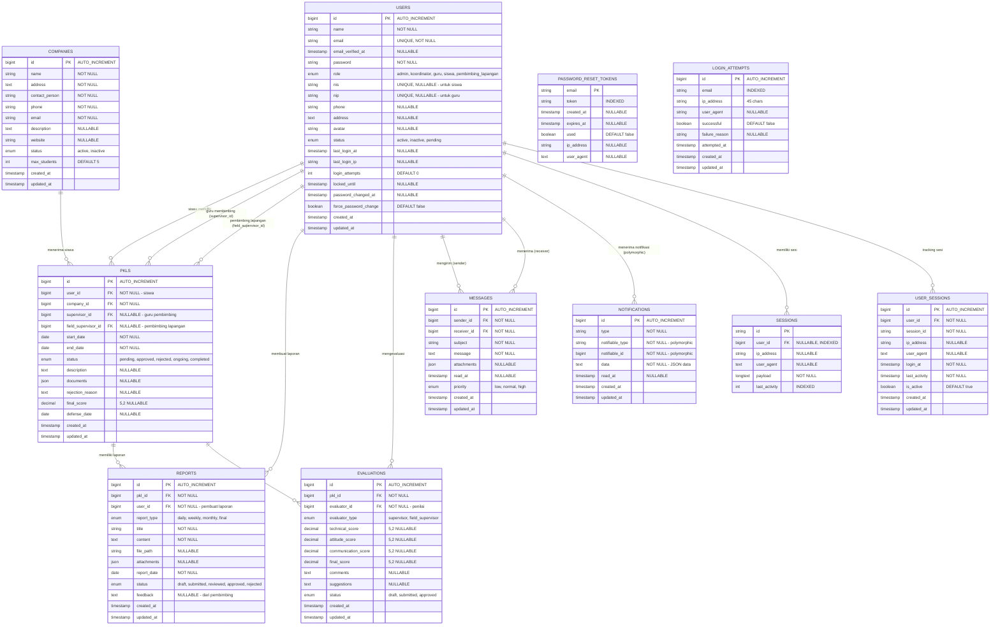

# Entity Relationship Diagram (ERD) - SPEKTRA PKL System

## Diagram ERD Lengkap

## Penjelasan Entitas dan Relasi

### 1. **USERS** (Entitas Utama)
**Deskripsi:** Menyimpan semua pengguna sistem dengan multi-role
**Atribut Kunci:**
- `role`: Menentukan jenis pengguna (admin, koordinator, guru, siswa, pembimbing_lapangan)
- `nis`: Khusus untuk siswa (unique)
- `nip`: Khusus untuk guru (unique)
- `status`: Status aktif/tidak aktif pengguna
- Security fields: `login_attempts`, `locked_until`, `password_changed_at`

### 2. **COMPANIES** (Perusahaan)
**Deskripsi:** Data perusahaan tempat siswa melakukan PKL
**Atribut Kunci:**
- `max_students`: Batas maksimal siswa yang bisa diterima
- `status`: Status aktif/tidak aktif perusahaan
- `contact_person`: PIC di perusahaan

### 3. **PKLS** (Praktek Kerja Lapangan)
**Deskripsi:** Data utama PKL dengan workflow status yang kompleks
**Atribut Kunci:**
- `status`: Workflow (pending → approved → ongoing → completed/rejected)
- `documents`: JSON untuk menyimpan dokumen persyaratan
- `final_score`: Nilai akhir PKL
- Multiple foreign keys untuk relasi supervisor

### 4. **REPORTS** (Laporan PKL)
**Deskripsi:** Laporan berkala yang dibuat siswa
**Atribut Kunci:**
- `report_type`: Jenis laporan (daily, weekly, monthly, final)
- `status`: Status review laporan
- `attachments`: JSON untuk multiple file attachments
- `feedback`: Feedback dari pembimbing

### 5. **EVALUATIONS** (Evaluasi PKL)
**Deskripsi:** Penilaian PKL dari supervisor dan pembimbing lapangan
**Atribut Kunci:**
- `evaluator_type`: Jenis penilai (supervisor/field_supervisor)
- Multiple scoring: `technical_score`, `attitude_score`, `communication_score`
- `final_score`: Nilai akhir hasil kalkulasi

### 6. **MESSAGES** (Sistem Komunikasi)
**Deskripsi:** Komunikasi internal antar pengguna sistem
**Atribut Kunci:**
- `priority`: Tingkat prioritas pesan
- `read_at`: Timestamp kapan dibaca
- `attachments`: JSON untuk file attachments

### 7. **NOTIFICATIONS** (Sistem Notifikasi)
**Deskripsi:** Notifikasi sistem menggunakan Laravel Notification (polymorphic)
**Atribut Kunci:**
- Polymorphic relationship dengan `notifiable_type` dan `notifiable_id`
- `data`: JSON data notifikasi

## Relasi Utama (Cardinality)

### **One-to-Many Relationships:**
1. **USERS → PKLS** (1:M)
   - Satu siswa bisa memiliki beberapa PKL (historis)
   - Satu guru bisa membimbing banyak siswa
   - Satu pembimbing lapangan bisa membimbing banyak siswa

2. **COMPANIES → PKLS** (1:M)
   - Satu perusahaan bisa menerima banyak siswa PKL

3. **PKLS → REPORTS** (1:M)
   - Satu PKL memiliki banyak laporan (harian, mingguan, dll)

4. **PKLS → EVALUATIONS** (1:M)
   - Satu PKL bisa dievaluasi berkali-kali oleh supervisor berbeda

5. **USERS → MESSAGES** (1:M untuk sender dan receiver)
   - Satu user bisa mengirim/menerima banyak pesan

### **Many-to-Many Relationships:**
- **USERS ↔ MESSAGES**: Melalui sender_id dan receiver_id (komunikasi antar user)

### **Polymorphic Relationships:**
- **NOTIFICATIONS**: Bisa terkait dengan berbagai entitas (User, PKL, Report, dll)

## Constraints dan Indexes

### **Foreign Key Constraints:**
- `ON DELETE CASCADE`: Untuk relasi yang dependent (reports, evaluations)
- `ON DELETE SET NULL`: Untuk relasi yang optional (supervisor assignments)

### **Unique Constraints:**
- `users.email`: Unique untuk login
- `users.nis`: Unique untuk siswa
- `users.nip`: Unique untuk guru

### **Indexes untuk Performance:**
- `email` pada login_attempts
- `ip_address` pada login_attempts
- `user_id` pada sessions
- `last_activity` pada sessions

## Catatan Implementasi

1. **Security**: Sistem memiliki tracking login attempts dan session management
2. **Audit Trail**: Semua tabel memiliki `created_at` dan `updated_at`
3. **Soft Deletes**: Tidak digunakan, menggunakan status field untuk deaktivasi
4. **JSON Fields**: Digunakan untuk data yang fleksibel (documents, attachments)
5. **Enum Fields**: Digunakan untuk status dan role yang terbatas dan terdefinisi

ERD ini mencerminkan sistem PKL yang komprehensif dengan multi-role, workflow yang kompleks, dan fitur komunikasi terintegrasi.
