# Use Case Diagram - SPEKTRA PKL System

## Deskripsi

Use Case Diagram menunjukkan interaksi antara aktor (pengguna) dengan sistem SPEKTRA PKL. Diagram ini menggambarkan fungsionalitas yang tersedia untuk setiap role dalam konteks SMK (Sekolah Menengah Kejuruan).

## Diagram Use Case

```mermaid
graph TB
    %% Actors
    Admin[👤 Admin]
    Koordinator[👤 Koordinator PKL]
    Guru[👤 Guru Pembimbing]
    Siswa[👤 Siswa]
    PembimbingLapangan[👤 Pembimbing Lapangan]
    
    %% System boundary
    subgraph "SPEKTRA PKL System"
        %% Authentication Use Cases
        Login[Login ke Sistem]
        Register[Registrasi Akun]
        ResetPassword[Reset Password]
        ChangePassword[Ubah Password]
        UpdateProfile[Update Profil]
        
        %% User Management Use Cases (Admin/Koordinator)
        ManageUsers[Kelola Data User]
        CreateUser[Tambah User Baru]
        UpdateUser[Update Data User]
        DeleteUser[Hapus User]
        ViewUserList[Lihat Daftar User]
        
        %% Company Management Use Cases (Admin/Koordinator)
        ManageCompanies[Kelola Data Perusahaan]
        CreateCompany[Tambah Perusahaan]
        UpdateCompany[Update Data Perusahaan]
        DeleteCompany[Hapus Perusahaan]
        ViewCompanyList[Lihat Daftar Perusahaan]
        
        %% PKL Management Use Cases
        RegisterPKL[Daftar PKL]
        ViewPKLList[Lihat Daftar PKL]
        ViewPKLDetail[Lihat Detail PKL]
        UpdatePKL[Update Data PKL]
        ApprovePKL[Approve PKL]
        RejectPKL[Reject PKL]
        AssignSupervisor[Assign Guru Pembimbing]
        
        %% Report Management Use Cases
        CreateReport[Buat Laporan]
        ViewReports[Lihat Laporan]
        UpdateReport[Update Laporan]
        SubmitReport[Submit Laporan]
        ReviewReport[Review Laporan]
        ApproveReport[Approve Laporan]
        RejectReport[Reject Laporan]
        ProvideFeedback[Berikan Feedback]
        
        %% Evaluation Use Cases
        CreateEvaluation[Buat Evaluasi]
        ViewEvaluations[Lihat Evaluasi]
        UpdateEvaluation[Update Evaluasi]
        SubmitEvaluation[Submit Evaluasi]
        ViewEvaluationResults[Lihat Hasil Evaluasi]
        
        %% Communication Use Cases
        SendMessage[Kirim Pesan]
        ViewMessages[Lihat Pesan]
        ReadMessage[Baca Pesan]
        ReplyMessage[Balas Pesan]
        
        %% Monitoring Use Cases
        ViewDashboard[Lihat Dashboard]
        MonitorProgress[Monitor Progress PKL]
        GenerateReports[Generate Laporan Sistem]
        ViewStatistics[Lihat Statistik]
        
        %% Document Management
        UploadDocuments[Upload Dokumen]
        ViewDocuments[Lihat Dokumen]
        DownloadDocuments[Download Dokumen]
        
        %% Notification Use Cases
        ViewNotifications[Lihat Notifikasi]
        MarkNotificationRead[Tandai Notifikasi Dibaca]
    end
    
    %% Admin Relationships
    Admin --> Login
    Admin --> ManageUsers
    Admin --> ManageCompanies
    Admin --> ViewPKLList
    Admin --> ViewPKLDetail
    Admin --> ApprovePKL
    Admin --> RejectPKL
    Admin --> AssignSupervisor
    Admin --> ViewReports
    Admin --> ReviewReport
    Admin --> ApproveReport
    Admin --> RejectReport
    Admin --> ViewEvaluations
    Admin --> SendMessage
    Admin --> ViewMessages
    Admin --> ViewDashboard
    Admin --> MonitorProgress
    Admin --> GenerateReports
    Admin --> ViewStatistics
    Admin --> UpdateProfile
    Admin --> ChangePassword
    Admin --> ViewNotifications
    
    %% Koordinator Relationships
    Koordinator --> Login
    Koordinator --> ManageUsers
    Koordinator --> ManageCompanies
    Koordinator --> ViewPKLList
    Koordinator --> ViewPKLDetail
    Koordinator --> ApprovePKL
    Koordinator --> RejectPKL
    Koordinator --> AssignSupervisor
    Koordinator --> ViewReports
    Koordinator --> ReviewReport
    Koordinator --> ApproveReport
    Koordinator --> ViewEvaluations
    Koordinator --> SendMessage
    Koordinator --> ViewMessages
    Koordinator --> ViewDashboard
    Koordinator --> MonitorProgress
    Koordinator --> GenerateReports
    Koordinator --> UpdateProfile
    Koordinator --> ChangePassword
    Koordinator --> ViewNotifications
    
    %% Guru Pembimbing Relationships
    Guru --> Login
    Guru --> ViewPKLList
    Guru --> ViewPKLDetail
    Guru --> ViewReports
    Guru --> ReviewReport
    Guru --> ApproveReport
    Guru --> RejectReport
    Guru --> ProvideFeedback
    Guru --> CreateEvaluation
    Guru --> ViewEvaluations
    Guru --> UpdateEvaluation
    Guru --> SubmitEvaluation
    Guru --> SendMessage
    Guru --> ViewMessages
    Guru --> ViewDashboard
    Guru --> MonitorProgress
    Guru --> UpdateProfile
    Guru --> ChangePassword
    Guru --> ViewNotifications
    
    %% Siswa Relationships
    Siswa --> Login
    Siswa --> Register
    Siswa --> ResetPassword
    Siswa --> RegisterPKL
    Siswa --> ViewPKLDetail
    Siswa --> UpdatePKL
    Siswa --> CreateReport
    Siswa --> ViewReports
    Siswa --> UpdateReport
    Siswa --> SubmitReport
    Siswa --> ViewEvaluations
    Siswa --> ViewEvaluationResults
    Siswa --> SendMessage
    Siswa --> ViewMessages
    Siswa --> ReadMessage
    Siswa --> ReplyMessage
    Siswa --> ViewDashboard
    Siswa --> UploadDocuments
    Siswa --> ViewDocuments
    Siswa --> DownloadDocuments
    Siswa --> UpdateProfile
    Siswa --> ChangePassword
    Siswa --> ViewNotifications
    Siswa --> MarkNotificationRead
    
    %% Pembimbing Lapangan Relationships
    PembimbingLapangan --> Login
    PembimbingLapangan --> ViewPKLList
    PembimbingLapangan --> ViewPKLDetail
    PembimbingLapangan --> ViewReports
    PembimbingLapangan --> ReviewReport
    PembimbingLapangan --> ProvideFeedback
    PembimbingLapangan --> CreateEvaluation
    PembimbingLapangan --> ViewEvaluations
    PembimbingLapangan --> UpdateEvaluation
    PembimbingLapangan --> SubmitEvaluation
    PembimbingLapangan --> SendMessage
    PembimbingLapangan --> ViewMessages
    PembimbingLapangan --> ViewDashboard
    PembimbingLapangan --> MonitorProgress
    PembimbingLapangan --> UpdateProfile
    PembimbingLapangan --> ChangePassword
    PembimbingLapangan --> ViewNotifications
    
    %% Include Relationships
    ManageUsers -.-> CreateUser
    ManageUsers -.-> UpdateUser
    ManageUsers -.-> DeleteUser
    ManageUsers -.-> ViewUserList
    
    ManageCompanies -.-> CreateCompany
    ManageCompanies -.-> UpdateCompany
    ManageCompanies -.-> DeleteCompany
    ManageCompanies -.-> ViewCompanyList
    
    ViewMessages -.-> ReadMessage
    SendMessage -.-> ViewMessages
    
    CreateReport -.-> UploadDocuments
    SubmitReport -.-> ViewNotifications
    ApproveReport -.-> ViewNotifications
    RejectReport -.-> ViewNotifications
    
    ApprovePKL -.-> AssignSupervisor
    ApprovePKL -.-> ViewNotifications
    RejectPKL -.-> ViewNotifications
```

## Penjelasan Aktor dan Use Cases

### 1. **Admin** 
**Deskripsi:** Administrator sistem dengan akses penuh ke semua fitur
**Use Cases Utama:**
- **Manajemen User:** CRUD operations untuk semua user (siswa, guru, koordinator, pembimbing lapangan)
- **Manajemen Perusahaan:** CRUD operations untuk data perusahaan mitra PKL
- **Manajemen PKL:** Approve/reject PKL, assign supervisor, monitoring semua PKL
- **Sistem Monitoring:** Dashboard, statistik, generate laporan sistem
- **Komunikasi:** Akses penuh ke sistem messaging

### 2. **Koordinator PKL**
**Deskripsi:** Koordinator yang mengelola proses PKL secara keseluruhan
**Use Cases Utama:**
- **Approval PKL:** Approve/reject pendaftaran PKL siswa
- **Assignment:** Assign guru pembimbing untuk setiap PKL
- **Monitoring:** Monitor progress semua PKL yang sedang berjalan
- **Manajemen Data:** Kelola data user dan perusahaan (terbatas)
- **Pelaporan:** Review dan approve laporan PKL

### 3. **Guru Pembimbing**
**Deskripsi:** Guru yang membimbing siswa selama PKL
**Use Cases Utama:**
- **Bimbingan:** Monitor progress siswa yang dibimbing
- **Review Laporan:** Review, approve/reject laporan siswa
- **Evaluasi:** Buat dan submit evaluasi untuk siswa
- **Komunikasi:** Komunikasi dengan siswa dan pembimbing lapangan
- **Feedback:** Berikan feedback untuk laporan dan progress siswa

### 4. **Siswa**
**Deskripsi:** Siswa SMK yang melakukan PKL
**Use Cases Utama:**
- **Pendaftaran:** Daftar PKL, upload dokumen persyaratan
- **Pelaporan:** Buat, update, dan submit laporan berkala (harian, mingguan, bulanan, final)
- **Komunikasi:** Komunikasi dengan guru pembimbing dan pembimbing lapangan
- **Monitoring:** Lihat progress PKL dan hasil evaluasi
- **Dokumen:** Upload dan manage dokumen PKL

### 5. **Pembimbing Lapangan**
**Deskripsi:** Supervisor di perusahaan yang membimbing siswa
**Use Cases Utama:**
- **Evaluasi:** Buat dan submit evaluasi untuk siswa PKL
- **Monitoring:** Monitor aktivitas harian siswa di perusahaan
- **Review:** Review laporan yang dibuat siswa
- **Komunikasi:** Komunikasi dengan siswa dan guru pembimbing
- **Feedback:** Berikan feedback untuk performance siswa

## Include/Extend Relationships

### **Include Relationships:**
- `ManageUsers` includes `CreateUser`, `UpdateUser`, `DeleteUser`, `ViewUserList`
- `ManageCompanies` includes `CreateCompany`, `UpdateCompany`, `DeleteCompany`, `ViewCompanyList`
- `ViewMessages` includes `ReadMessage`
- `CreateReport` includes `UploadDocuments`

### **Extend Relationships:**
- `ApprovePKL` extends to `AssignSupervisor` (optional assignment)
- `SubmitReport` extends to `ViewNotifications` (notification trigger)
- `ApproveReport`/`RejectReport` extends to `ViewNotifications`

## Business Rules dan Constraints

### **Authorization Rules:**
1. **Admin & Koordinator:** Full access ke user dan company management
2. **Guru:** Hanya bisa akses PKL yang mereka supervise
3. **Siswa:** Hanya bisa akses PKL mereka sendiri
4. **Pembimbing Lapangan:** Hanya bisa akses PKL di perusahaan mereka

### **Workflow Rules:**
1. **PKL Registration:** Siswa → Koordinator/Admin approval → Guru assignment
2. **Report Submission:** Siswa create → Submit → Guru/Pembimbing review → Approve/Reject
3. **Evaluation:** Guru/Pembimbing create → Submit → Final scoring

### **Data Access Rules:**
1. **Role-based filtering** pada semua list views
2. **Ownership validation** untuk CRUD operations
3. **Status-based permissions** (e.g., hanya draft reports yang bisa di-edit)

## Catatan Implementasi

1. **Authentication:** Semua use cases memerlukan login kecuali Register dan Reset Password
2. **Authorization:** Role-based middleware mengontrol akses ke setiap use case
3. **Notifications:** Sistem otomatis generate notifikasi untuk status changes
4. **Audit Trail:** Semua actions penting di-log untuk tracking
5. **File Management:** Upload/download dokumen terintegrasi dengan storage system

Use Case Diagram ini menjadi foundation untuk development dan testing, memastikan semua fungsionalitas sesuai dengan kebutuhan setiap role dalam sistem PKL SMK.
